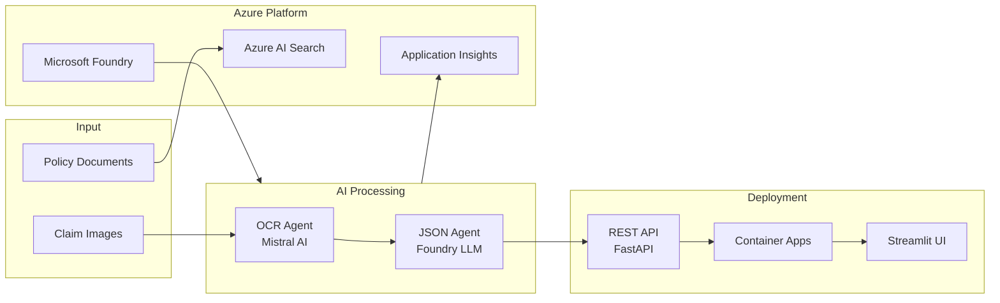

# Claims Processing with Microsoft Foundry Agents MicroHack

- [MicroHack introduction](#microhack-introduction)
- [MicroHack context](#microhack-context)
- [Objectives](#objectives)
- [MicroHack challenges](#microhack-challenges)
- [Contributors](#contributors)

# MicroHack introduction

This MicroHack scenario walks through building an end-to-end, AI-native insurance claims processing solution using Microsoft Foundry, Azure AI Search, and the Model Context Protocol (MCP). You will compare document processing approaches, orchestrate multiple specialized agents, and deliver a production-style API workflow.

The lab focuses on practical enterprise outcomes:

- Compare OCR and document understanding patterns (Foundry-hosted vision models, Mistral Document AI, Azure Document Intelligence)
- Build and evaluate multi-agent workflows with the Microsoft Agent Framework
- Deploy a reusable MCP-enabled claims workflow through an API layer

This lab is not a complete conceptual deep dive into every Azure AI service. It is designed as a guided, hands-on build that gives participants practical implementation experience across search, agents, monitoring, deployment, and validation.

Optional reading after the lab:

- [Azure AI Foundry documentation](https://learn.microsoft.com/azure/ai-foundry/)
- [Model Context Protocol overview](https://modelcontextprotocol.io/introduction)
- [Azure AI Search documentation](https://learn.microsoft.com/azure/search/)

# MicroHack context

Insurance claims processing typically involves multiple disconnected steps: document ingestion, OCR extraction, policy lookup, validation, and human-facing reporting. This MicroHack demonstrates how to unify those steps into a modular AI workflow where each specialized agent handles a clear responsibility and the end result can be consumed through API channels.

The scenario is designed for hackathon teams that want to learn modern Microsoft Foundry patterns while producing a concrete, demonstrable solution.

## Architecture overview

# Objectives

After completing this MicroHack you will:

- Know how to implement and compare multiple AI document processing approaches for claims data
- Understand how to build and orchestrate multi-agent workflows with Microsoft Agent Framework and Microsoft Foundry
- Know how to expose orchestrated workflows through an MCP-compatible API layer
- Know how to validate claim coverage by matching extracted claim data against policy documents

# MicroHack challenges

## General prerequisites

This MicroHack has a few important prerequisites.

In order to use the MicroHack time effectively, complete these setup tasks before the session starts:

- GitHub account with access to GitHub Codespaces and GitHub Copilot
- Basic Python skills (JSON handling, API calls, virtual environments)
- Familiarity with Azure and Generative AI fundamentals
- Active Azure subscription with Owner rights
- Ability to provision resources in Sweden Central or another supported region

Permissions for deployment:

- Owner (or equivalent delegated rights) on the target subscription/resource group used during the hack
- Ability to create and configure Azure AI resources, storage, and networking defaults required by the challenges

## Challenge Path

This MicroHack is intentionally scoped to a shorter end-to-end path with 5 challenges.

## Challenges

- [Challenge 01 - Environment Setup and Azure Resource Deployment](challenges/challenge-1/README.md) <- Start here
- [Challenge 02 - Document Processing and Vectorized Search](challenges/challenge-2/README.md)
- [Challenge 03 - Build Your 2 Claims Processing Agents](challenges/challenge-3/README.md)
- [Challenge 04 - Agent Orchestration and MCP Server Deployment](challenges/challenge-4/README.md)
- [Challenge 05 - Policy Matching and Coverage Validation](challenges/challenge-5/README.md)

## Solutions - Spoiler warning

- [Challenge 01 Walkthrough](walkthrough/challenge-1/README.md)
- [Challenge 02 Walkthrough](walkthrough/challenge-2/README.md)
- [Challenge 03 Walkthrough](walkthrough/challenge-3/README.md)
- [Challenge 04 Walkthrough](walkthrough/challenge-4/README.md)
- [Challenge 05 Walkthrough](walkthrough/challenge-5/README.md)

## Contributors

- Marta Santos ([Github](https://github.com/microsoft/claims-processing-hack/tree/main), [LinkedIn](https://www.linkedin.com/in/martaldsantos/))

## Contributing

This project welcomes contributions and suggestions. Most contributions require you to agree to a
Contributor License Agreement (CLA) declaring that you have the right to, and actually do, grant us
the rights to use your contribution. For details, visit [Contributor License Agreements](https://cla.opensource.microsoft.com).

When you submit a pull request, a CLA bot will automatically determine whether you need to provide
a CLA and decorate the PR appropriately (for example, status check, comment). Follow the instructions
provided by the bot. You will only need to do this once across all repos using our CLA.

This project has adopted the [Microsoft Open Source Code of Conduct](https://opensource.microsoft.com/codeofconduct/).
For more information see the [Code of Conduct FAQ](https://opensource.microsoft.com/codeofconduct/faq/) or
contact [opencode@microsoft.com](mailto:opencode@microsoft.com) with any additional questions or comments.

## Trademarks

This project may contain trademarks or logos for projects, products, or services. Authorized use of Microsoft
trademarks or logos is subject to and must follow
[Microsoft's Trademark and Brand Guidelines](https://www.microsoft.com/legal/intellectualproperty/trademarks/usage/general).
Use of Microsoft trademarks or logos in modified versions of this project must not cause confusion or imply Microsoft sponsorship.
Any use of third-party trademarks or logos are subject to those third-party policies.
